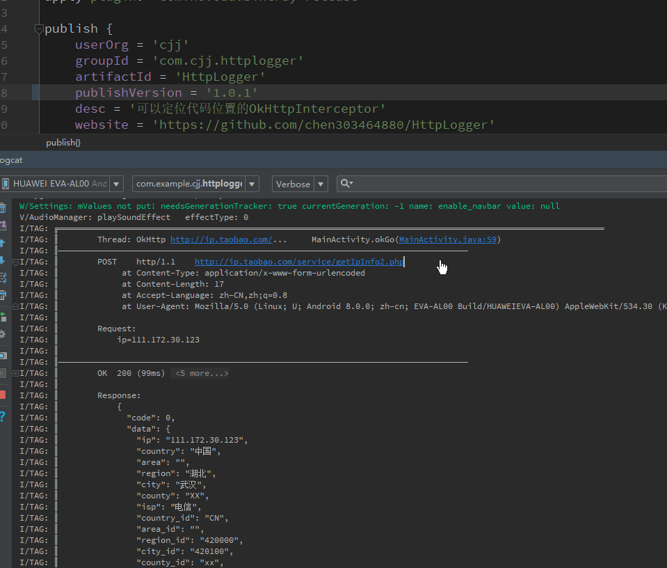

## HttpLogger简介
* HttpLogger可以方便的在logcat中查看网络请求参数及项目中发出网络请求的代码的位置,点击即可跳转
  

#### 使用Gradle构建时添加一下依赖即可:
```javascript
implementation 'com.cjj.httplogger:HttpLogger:1.0.0'
```
##### 初始化
```java
// 创建OkHttpClient
OkHttpClient.Builder builder = new OkHttpClient.Builder();
    if (BuildConfig.DEBUG) {//debug时添加拦截器
        HttpLogger interceptor = new HttpLogger.Builder()
            //logcat输出的tag
            .setTag("TAG")
            //logcat输出的级别
            .setLevel(Log.INFO)
            //返回的结果的最大行数,超过将折叠
            .setMaxLines(30)
            //将当前位置传递给Interceptor的HeaderName
            .setHeaderName("location")
            //logcat检测到包含此字符串的行将被折叠,默认为"\t\t\t at %s "最后一个空格为\#u00A0的空格
            //修改之后需要在File->Settings->Editor->General->Console中添加相应的字段
            //.setContain("HttpLogger")
            .build();
        //添加拦截器
        builder.addInterceptor(interceptor);
    }
```

### OkHttp用法
```java
...
Builder builder = new okhttp3.Request.Builder()
                    .url(url)
                    .get();
                    
    if (BuildConfig.DEBUG) {//debug时在header中添加代码信息
        //headerName要与setHeaderName的字段相同
        builder.addHeader("location", CodeUtils.getCodeLine()); 
    }       
Request request = builder.build();
...
```

### retrofit用法
```java
...
@FormUrlEncoded
@POST("service/getIpInfo2.php")
//动态添加header
Observable<String> getIp(@Header("location") String codeLine, @Field("ip") String params);
...

...
//调用方法时,将当前代码位置放入header
HttpUtils.getInstance().getIp(CodeUtils.getCodeLine(), etIp.getText().toString());
...
```
#### OkGo用法
```java
....
Request request = OkGo.<String>get(url);
//debug下添加header信息
if (BuildConfig.DEBUG) {
    request.headers("location", CodeUtils.getCodeLine());
}
....
````
#### 关于CodeUtils.getCodeLine();
1. CodeUtils.getCodeLine()

会返回 MainActivity.retrofit(MainActivity.java:69) 这种格式的字符串用于定位代码，默认情况下哪里调用返回哪里的位置，当前位置就为MainActivity中的retrofit方法中调用，位于MainActivity文件中的第69行。 

2. CodeUtils.getCodeLine(Class excludeClass);

大家在使用OkHttp时一定会封装一个统一的网络请求类(比如叫做OkHttpUtils)，将builder.addHeader(...,CodeUtils.getCodeLine())也做了封装，于是在MainActivity中发出请求就打印的是OkHttpUtils中的代码位置，这个时候需要排除OkHttpUtils，代码修改成CodeUtils.getCodeLine(OkHttpUtils.class)，则会排除OkHttpUtils在栈中的方法从而获取到MainActivity中的调用位置。

3. CodeUtils.getCodeLine(int offset);

如果使用排除也无法获取到正确的位置，可以使用直接添加偏移量的方法
> CodeUtils.printStackTrace();//打印当前栈信息

```
I/TAG1: ╔════════════════════════════════════════════════════════════════════════════════════════════════════════════════
I/TAG0: ║ -4	dalvik.system.VMStack.getThreadStackTrace(Native Method)
I/TAG1: ║ -3	java.lang.Thread.getStackTrace(Thread.java:1556)
I/TAG0: ║ -2	com.cjj.httplogger.CodeUtils.getStackTraceElement(CodeUtils.java:77)
I/TAG1: ║ -1	com.cjj.httplogger.CodeUtils.printStackTrace(CodeUtils.java:54)
I/TAG0: ║  0	com.example.cjj.httplogger.MainActivity.onCreate(MainActivity.java:36)
I/TAG1: ║  1	android.app.Activity.performCreate(Activity.java:7383)
I/TAG0: ║  2	android.app.Instrumentation.callActivityOnCreate(Instrumentation.java:1218)
I/TAG1: ║  3	android.app.ActivityThread.performLaunchActivity(ActivityThread.java:3256)
I/TAG0: ║  4	android.app.ActivityThread.handleLaunchActivity(ActivityThread.java:3411)
I/TAG1: ║  5	android.app.ActivityThread.-wrap12(Unknown Source:0)
I/TAG0: ║  6	android.app.ActivityThread$H.handleMessage(ActivityThread.java:1994)
I/TAG1: ║  7	android.os.Handler.dispatchMessage(Handler.java:108)
I/TAG0: ║  8	android.os.Looper.loop(Looper.java:166)
I/TAG1: ║  9	android.app.ActivityThread.main(ActivityThread.java:7529)
I/TAG0: ║ 10	java.lang.reflect.Method.invoke(Native Method)
I/TAG1: ║ 11	com.android.internal.os.Zygote$MethodAndArgsCaller.run(Zygote.java:245)
I/TAG0: ╚═══════════════════════════════════════════════════════════════════════════════════════════════════════════════
```
在控制台输出的信息中找到需要的代码位置标记的偏移量即可。

 


----
### 关于作者
* Email： <303464880@qq.com>
* QQ： 303464880
* 有任何建议或者使用中遇到问题都可以给我发邮件, 也可以加我QQ